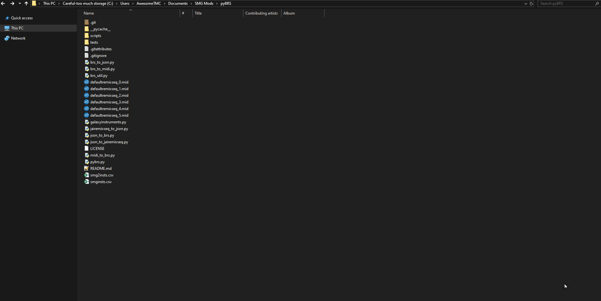

# pybrs
A Python library for opening Super Mario Galaxy 1/2s "BRS" format, which controls what notes the NoteFairy (Rainbow Notes) plays. Made by me, some names in smg2insts.csv from SY24 & Lumi.
To download, click the green button that says "Code" and then "Download Zip". 
# Requirements
- Python 3(.9 or newer?)
- [pyjkernel](https://github.com/SunakazeKun/pyjkernel) for most scripts here (the ones involving jairemixseq). Install it using `pip install pyjkernel` in a command prompt window.
- (Optional) Visual Studio Code for json editing
# Scripts
Scripts are provided to make it easy to edit the BRS. 

To use them, drag the file you want to convert onto the python file or use command prompt with the arguments.

All scripts are listed below.

Optional arguments are represented with `[square brackets]`. 

Required arguments are represented with `(parenthesis)`.
## brs_to_json.py (Input BRS File) [Output JSON File]
Converts a BRS into a readable json.
## jairemixseq_to_json.py (Input JaiRemixSeq File) [Output JSON File]
Unpacks the BRS in JaiRemixSeq.arc and converts it into a readable json.

## json_to_brs.py (Input JSON File) [Output BRS File]
Converts a json into a BRS.
## json_to_jairemixseq.py (Input JSON File) [Output JaiRemixSeq File]
Converts the json to a BRS and puts it in a new .arc.

## brs_to_midi.py [`-m`] [`-smg`] (Input BRS File) [Output MIDI file]
Makes a MIDI file for each "Song" in the BRS. The file name used for output will have a number after it specifying what index it is in the BRS.

`-m` will let you manually input the tempos. Not recommended unless you know what you're doing.

`-smg` will switch to using SMG instrument names instead of SMG2. As of writing this, there are no instrument names documented for SMG, so using SMG2 instrument names may be ideal.

## midi_to_brs.py [`-m`] [`-ms`] [`-smg`] [`-ps` Player Speed] [`-o` Output BRS file] (Input MIDI files)
Makes a BRS file out of several MIDI (.mid) files.

If you want to specify the output BRS file name, put -o at the start, then the output BRS file path, then the input midi files.

If you want that chosen automatically, do not put -o or the output BRS file at the start. 

`-m` will let you manually input the tempos. Not recommended unless you know what you're doing.

`-ms` will let you manually input "subdivision" or use more/less rainbow notes to represent the same song, at the same tempo. Setting the subdivision amount to 2 uses twice the number of rainbow notes. Setting it to 0.5 uses half the number of rainbow notes. 

`-smg` will switch to using SMG instrument names instead of SMG2. As of writing this, there are no instrument names documented for SMG, so using SMG2 instrument names may be ideal.

`-ps` lets you set the player speed used for the estimated distance calculation at the end. Put the speed you want to use directly after the `-ps`.

If you aren't using the flags above, you can simply drag all the midis you want in the BRS onto the python script. However, make sure when you've selected multiple, you drag the file you want as the first index onto the python script.
A demonstration is below.



The index in the BRS directly corresponds to the number in NoteFairy's obj_arg4. Any invalid index will crash the game.

### Preparing the MIDI
Get the MIDI you want to import, open it in your favorite DAW (FL Studio, LMMS, etc.), and use the [SMG2 IBNK Soundfont Collection](https://mega.nz/file/od80zawY#84f9PZfn34_u00PGDpaOg80gNqpemgT_38THpMWQ8OU) to figure out what instrument you want to use.

BRS is limited by memory, and doesn't support several MIDI features. Please keep that in mind as you decide what MIDIs to convert.

The important part, though, is the track name. It should start with a `#`, and then the unique number identifying the BankProgNo. `#0103` for `S_Y_PERCSET_003`, for example. Once each track follows this format, you're ready to export it.

Additionally, please make sure the MIDI you are using ends with `.mid`, and there is only one tempo used in the MIDI.

### IMPORTANT NOTE
The duration can cause unexpected results due to a bug in the game. Put the corresponding game's patches below in your riivolution XML to fix it.

SMG2:
```xml
<!-- Fix long NoteFairy notes causing unexpected behavior - SMG2 -->
<memory offset="0x80587e24" value="54a4043e" original="54a4063e"/> <!-- E, J, P -->
<memory offset="0x80587f24" value="54a4043e" original="54a4063e"/> <!-- K, T -->
```
SMG:
```xml
<!-- Fix long NoteFairy notes causing unexpected behavior - SMG -->
<memory offset="0x8048bc4c" value="54a4043e" original="54a4063e"/> <!-- E -->
<memory offset="0x8048BC48" value="54a4043e" original="54a4063e"/> <!-- J -->
<memory offset="0x8048BC68" value="54a4043e" original="54a4063e"/> <!-- P -->
<memory offset="0x8048DE90" value="54a4043e" original="54a4063e"/> <!-- K -->
```
Let me know if these break anything by [creating an issue](https://github.com/AwesomeTMC/pyBRS/issues/new/choose) on GitHub.

## jairemixseq_to_midi.py [`-m`] [`-ms`] [`-smg`] (Input JaiRemixSeq File) [Output MIDI file]
The same as `brs_to_midi.py`, but with JaiRemixSeq as the input.

## midi_to_jairemixseq.py [`-m`] [`-ms`] [`-smg`] [`-ps` Player Speed] [`-o` Output JaiRemixSeq file] (Input MIDI files)
The same as `midi_to_brs.py`, but with JaiRemixSeq as the output.
